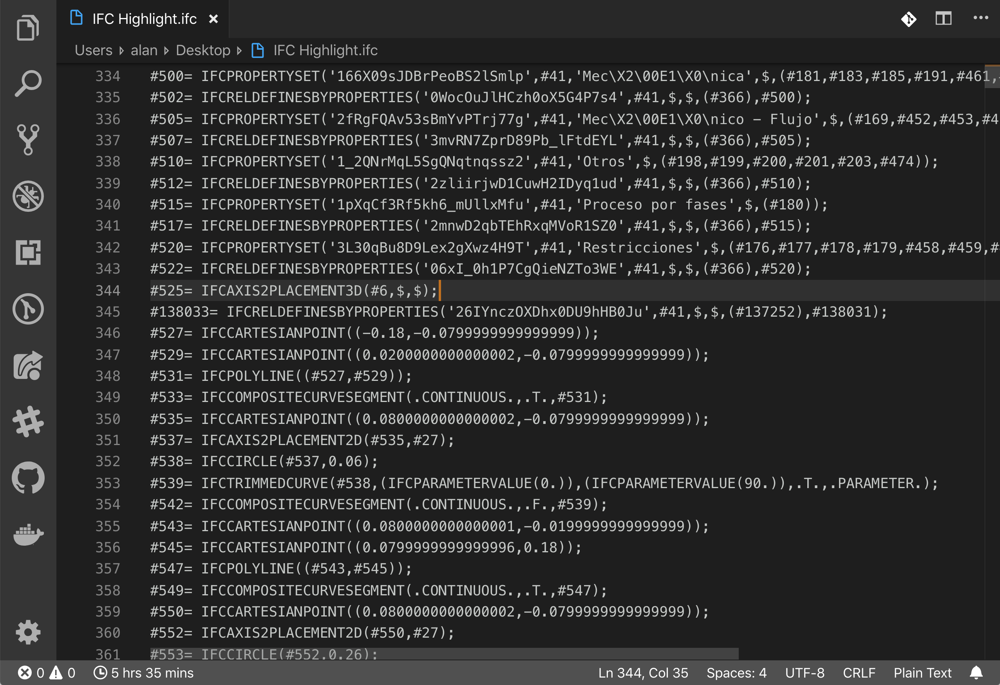
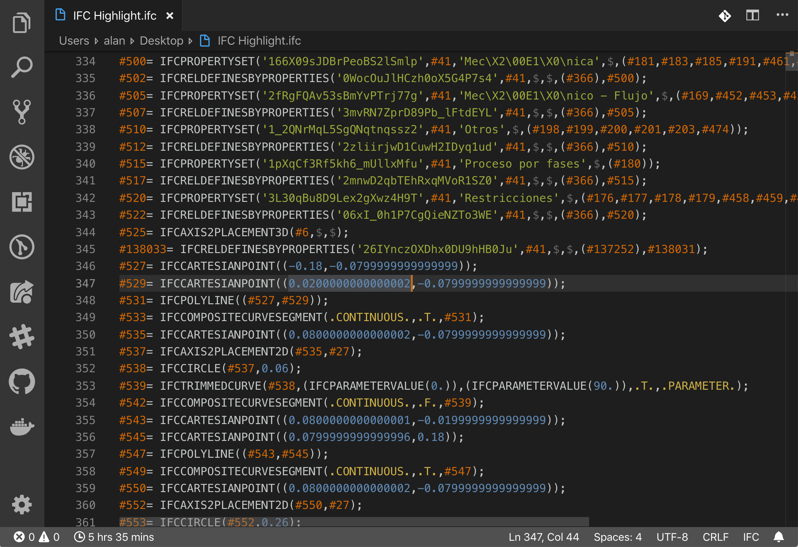
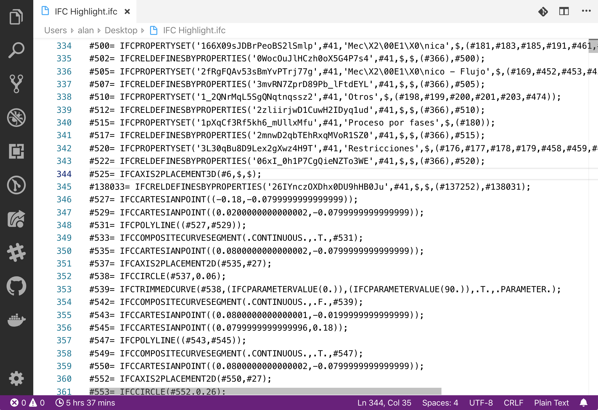
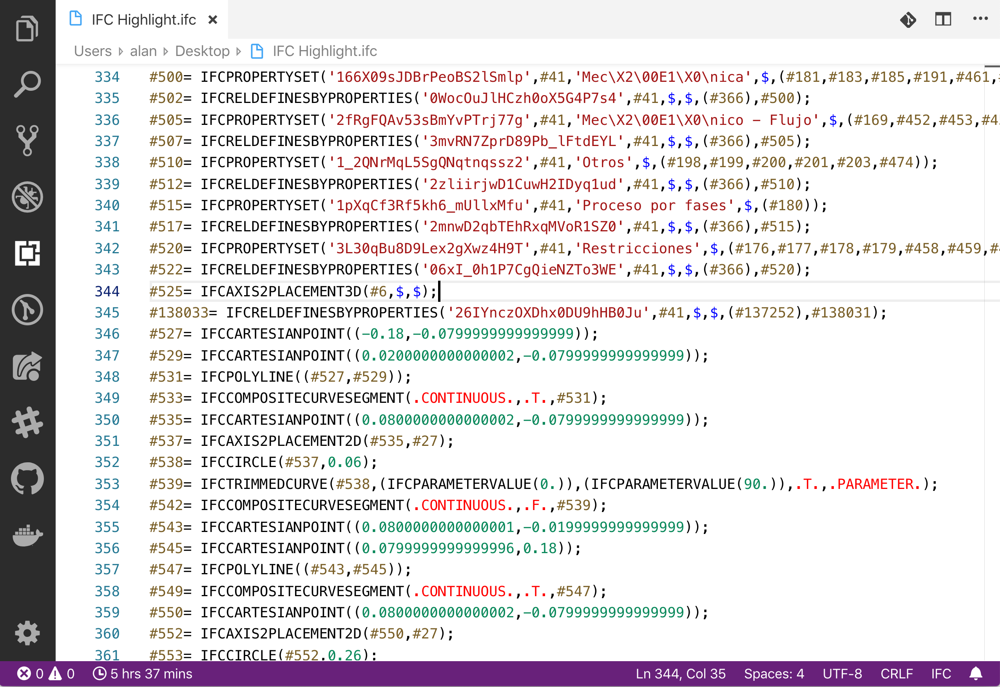

# IFC Syntax VSCode Extension

> This extension is in early stages of development!

## Description

***IFC Syntax Highlight*** is a Visual Studio Code extension that allows extends the capabilities of the program to support Industry Foundation Classes (also known as IFC) files, using the `.ifc` extension.

## Features

Currently it supports:

* Basic syntax highlighting
* Basic folding capabilities
  * Only HEADER and DATA sections can be folded.
* More features will be added in the near future...

## Screenshots

## Known Issues

Currently, the entire *HEADER* section of the file will be colored as a comment, this will change in future releases.
